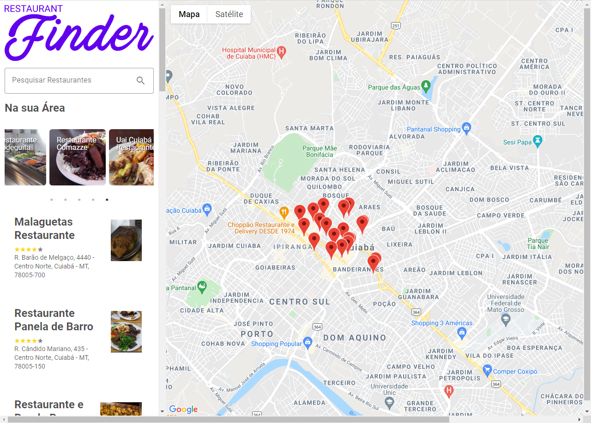

# Site para busca de restaurantes próximos

Projeto feito como parte do desenvolvimento do bootcamp Localizalabs ReactJS, ofertado pela [Digital Innovation One](https://digitalinnovation.one/).



## Recursos utilizados

### Configuração

1. [React](https://pt-br.reactjs.org/)
2. [Create React App](https://create-react-app.dev/)

### Estilos

1. [Material-ui](https://material-ui.com/)
2. [Styled Components](https://styled-components.com/)

### Pacotes

1. [React Rating Stars Component](https://www.npmjs.com/package/react-rating-stars-component)
2. [Google Maps React](https://www.npmjs.com/package/google-maps-react)
3. [React Slick](https://www.npmjs.com/package/react-slick)

### APIs:

1. [Google Maps JS](https://developers.google.com/maps/documentation/javascript/overview?hl=pt-br)
2. [Google Places](https://developers.google.com/maps/documentation/places/web-service/overview?hl=pt-br)

## Passo-a-passo de execução

1. Clonar o repositório

```
git clone https://github.com/Instantki/localiza-bootcamp-restaurant-search.git
```

2. Acessar a pasta onde o projeto foi salvo

```
cd <pasta onde foi clonado>/<localiza-bootcamp-restaurant-search>
```

3. Instalar as dependências do projeto

```
npm install
```

4. Criar variável de ambiente e adicionar a chave de API do Google:

   1. Criar um arquivo .env na raiz do projeto
   2. Adicionar sua chave de API do google no arquivo .env

   ```
   REACT_APP_GOOGLE_API_KEY=<sua chave de api>
   ```

5. Executar o projeto

```
npm start
```

6. Por padrão o projeto estará disponível no endereço

```
localhost:3000
```

### Créditos

[Patrick Narciso](https://github.com/patrick-narciso) - Instrutor DIO
